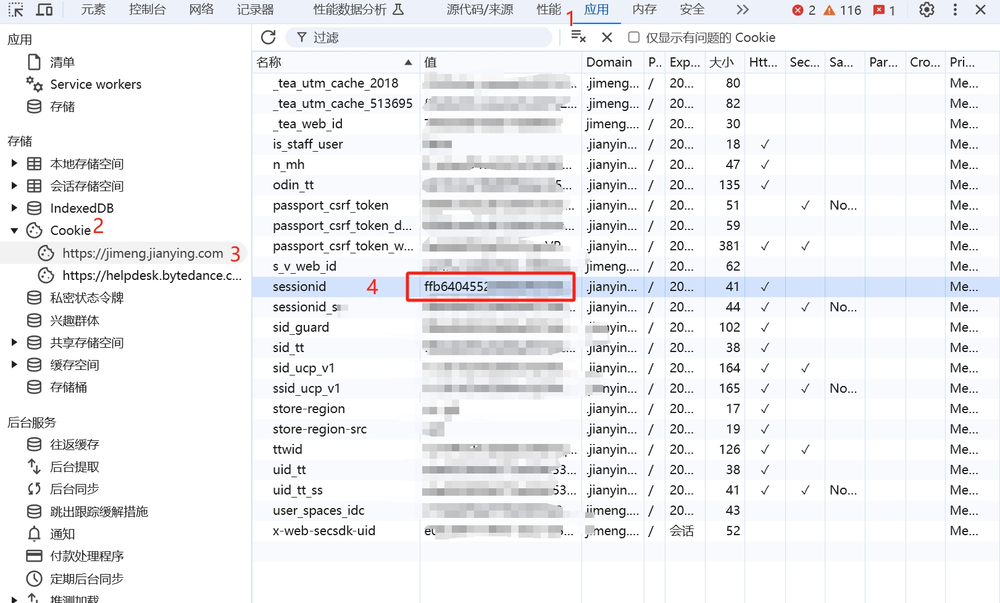

# SessionId 提取步骤文档

## 什么是 SessionId？

SessionId 是即梦网站用于识别用户身份的会话标识，通过获取 SessionId，可以让工具以您的身份调用即梦API。

## 提取步骤

### 方法一：通过浏览器开发者工具获取

#### 步骤 1：登录即梦官网
1. 打开浏览器（推荐使用 Chrome 或 Edge）
2. 访问即梦官网：https://jimeng.jianying.com
3. 使用您的账号登录

#### 步骤 2：打开开发者工具
1. 登录成功后，按下 **F12** 键
2. 或者右键点击页面，选择"检查"或"审查元素"
3. 开发者工具会在浏览器底部或右侧打开

#### 步骤 3：切换到 Network（网络）标签
1. 在开发者工具顶部，找到并点击 **Network**（网络）标签
2. 如果看不到任何请求，请刷新页面（F5）

#### 步骤 4：找到请求
1. 在 Network 标签中，找到任意一个请求
2. 建议选择一个 API 请求（通常是以 `/api` 开头的请求）
3. 点击该请求

#### 步骤 5：查看请求头
1. 在右侧面板中，找到 **Headers**（请求头）标签
2. 向下滚动找到 **Request Headers**（请求头）部分
3. 找到 **Cookie** 字段

#### 步骤 6：提取 SessionId
1. 在 Cookie 字段中，找到 `sessionId=xxxxxx` 的部分
2. 复制 `sessionId=` 后面的值（不包含 `sessionId=` 本身）
3. 例如：如果 Cookie 显示 `sessionId=abc123def456; other=value`
4. 那么您需要复制的是：`abc123def456`

#### 示例截图

下图展示了如何在浏览器开发者工具中找到 SessionId：

**说明**：
- 红色框标记的位置就是 sessionId 的值
- 请确保复制完整的值，不要遗漏任何字符

### 方法二：通过 Application 标签获取

#### 步骤 1-2：同方法一
1. 登录即梦官网
2. 打开开发者工具（F12）

#### 步骤 3：切换到 Application 标签
1. 在开发者工具顶部，找到并点击 **Application** 标签
2. 如果没有看到，点击 `>>` 图标，在下拉菜单中选择 Application

#### 步骤 4：查看 Cookies
1. 在左侧菜单中，展开 **Cookies**
2. 点击即梦网站的域名（如 `https://jimeng.jianying.com`）

#### 步骤 5：找到并复制 SessionId
1. 在右侧列表中，找到 **Name** 为 `sessionId` 的条目
2. 双击 **Value** 列的值
3. 选中并复制整个值

## 注意事项

### 安全提示
1. **不要分享**：SessionId 相当于您的登录凭证，请勿分享给他人
2. **定期更新**：SessionId 可能会过期，如果工具提示认证失败，请重新获取
3. **安全存储**：工具会将您的 SessionId 安全存储在本地配置中

### 有效期说明
1. SessionId 的有效期通常为几天到几周不等
2. 如果您在即梦网站退出登录，SessionId 将失效
3. 建议定期检查并更新 SessionId

### 常见问题

#### Q1: 找不到 sessionId 怎么办？
**A:** 请确保：
- 已经成功登录即梦网站
- 在正确的域名下查找（jimeng.jianying.com）
- 尝试刷新页面后再查找

#### Q2: SessionId 很长，是否正确？
**A:** 是的，SessionId 通常是一个很长的字符串，可能包含字母、数字和特殊字符，这是正常的。

#### Q3: 配置后提示认证失败？
**A:** 可能的原因：
- SessionId 已过期，请重新获取
- 复制时包含了多余的空格或字符
- 账号权限不足

## 配置使用

获取到 SessionId 后，在工具中进行配置：

1. 点击页面右上角的齿轮图标 ⚙️
2. 在弹出的配置窗口中，选择"SessionId 方式"标签
3. 将复制的 SessionId 粘贴到输入框中
4. 点击"确定"保存配置

配置成功后，工具将使用您的 SessionId 调用即梦API。

## 技术原理

SessionId 是 Web 应用中常用的会话管理机制：
- 当您登录网站时，服务器会创建一个会话并生成唯一的 SessionId
- 该 SessionId 通过 Cookie 存储在浏览器中
- 后续请求时，浏览器会自动携带 SessionId
- 服务器通过 SessionId 识别用户身份

工具通过模拟浏览器的行为，在 API 请求中携带您的 SessionId，从而以您的身份调用即梦API。

## 替代方案

如果您不想使用 SessionId 方式，也可以选择使用 API Key 方式：

1. 进入火山引擎
2. 搜索火山方舟
3. 进入火山方舟管理控制台
4. 点击左侧 API Key 管理
5. 点击创建 API Key
6. （可选）编辑权限，选择自定义权限，选择以下模型即可：
   - Doubao-Seedream-5.0-lite
   - Doubao-Seedream-4.5

**支持的模型：**
- Doubao-Seedream-5.0-lite
- Doubao-Seedream-4.5

API Key 方式更加稳定和安全，推荐优先使用。

---

如有任何问题，请参考工具的帮助文档或联系技术支持。
